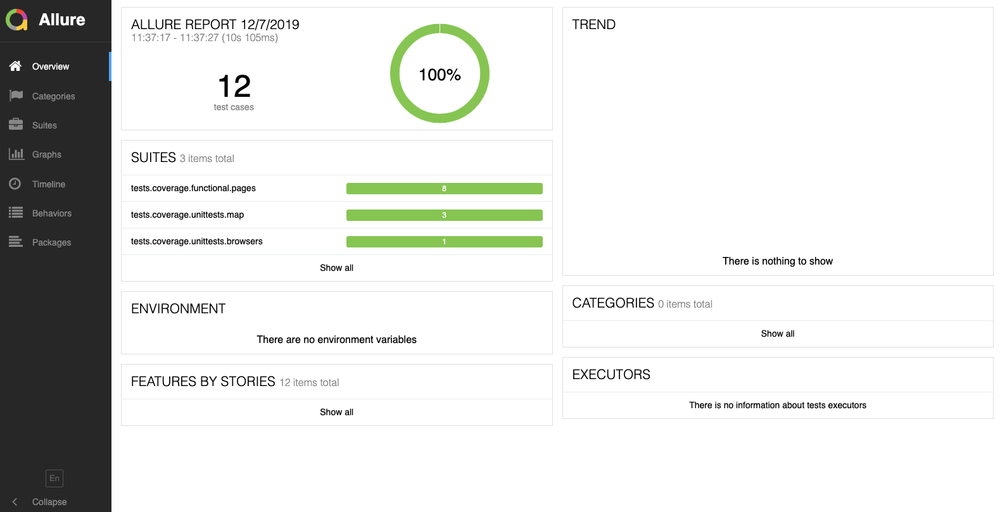

[](https://www.python.org/)
[](https://travis-ci.org/vyahello/python-page-object)
[](https://coveralls.io/github/vyahello/python-page-object?branch=master)
[](https://github.com/psf/black)
[](http://flake8.pycqa.org/)
[](http://mypy-lang.org/)
[](LICENSE.md)
[](https://www.codefactor.io/repository/github/vyahello/python-page-object)
[](https://https://vyahello.github.io/python-page-object)
[](https://www.elegantobjects.org)

# Python page object model (PyPOM)
> Represent most popular OOD pattern for Web UI automation using python programming language (for learning reference only).
>
> Automated tests are demonstrated on http://newtours.demoaut.com/mercurywelcome.php web application. 

## Tools

### Production
- python 3.6, 3.7, 3.8
- [pytest](https://pypi.org/project/pytest/) framework
- [selenium](https://selenium.dev/) library
- [pom](https://www.guru99.com/page-object-model-pom-page-factory-in-selenium-ultimate-guide.html) framework
- [allure](https://docs.qameta.io/allure/) reporting
- [travis](https://travis-ci.org/) CI

### Development
- [mypy](http://mypy.readthedocs.io/en/latest)
- [black](https://black.readthedocs.io/en/stable/)
- [flake8](http://flake8.pycqa.org/en/latest/)

> In addition a source code is **fully** [type annotated](https://docs.python.org/3/library/typing.html) ⭐

## Quick start
From the root directory of your shell run following command:

```bash
./run-tests.sh help

Tool allows to simplify run of automated tests for POM sample project.

Available actions:
 - smoke                 run automated smoke tests
 - unittest              run automated unittest tests
 - all                   run all automated tests
 - help                  display help

Note:            help will be provided in case of no input parameters
```

### Tests (html) report sample
Run a bunch of tests (e.g smoke) via following command:
```bash
./run-tests.sh smoke
```

Then please open `test-report.html` file to see detailed testing report e.g:


### Generate allure report
Please follow next instruction to generate allure report (mac OS example):
1. Update java via `brew cask install adoptopenjdk`
2. Install allure via `brew install allure`
3. Generate allure project via `allure serve report`



## Development notes

### Release History

Please check [changelog](CHANGELOG.md) file to get more details about actual versions and it's release notes.

### Meta
Author – _Volodymyr Yahello_.

Distributed under the `GPL v3` license. See [license](LICENSE.md) for more information.

You can reach out me at:
* [vyahello@gmail.com](vyahello@gmail.com)
* [https://github.com/vyahello](https://github.com/vyahello)
* [https://www.linkedin.com/in/volodymyr-yahello-821746127](https://www.linkedin.com/in/volodymyr-yahello-821746127)

### Contributing
I would highly appreciate any contribution and support. If you are interested to add your ideas into project please follow next simple steps:

1. Clone the repository
2. Configure `git` for the first time after cloning with your `name` and `email`
3. `pip install -r requirements.txt` to install all project dependencies
4. `pip install -r requirements-dev.txt` to install all development project dependencies
5. Create your feature branch (`git checkout -b feature/fooBar`)
6. Commit your changes (`git commit -am 'Add some fooBar'`)
7. Push to the branch (`git push origin feature/fooBar`)
8. Create a new Pull Request
